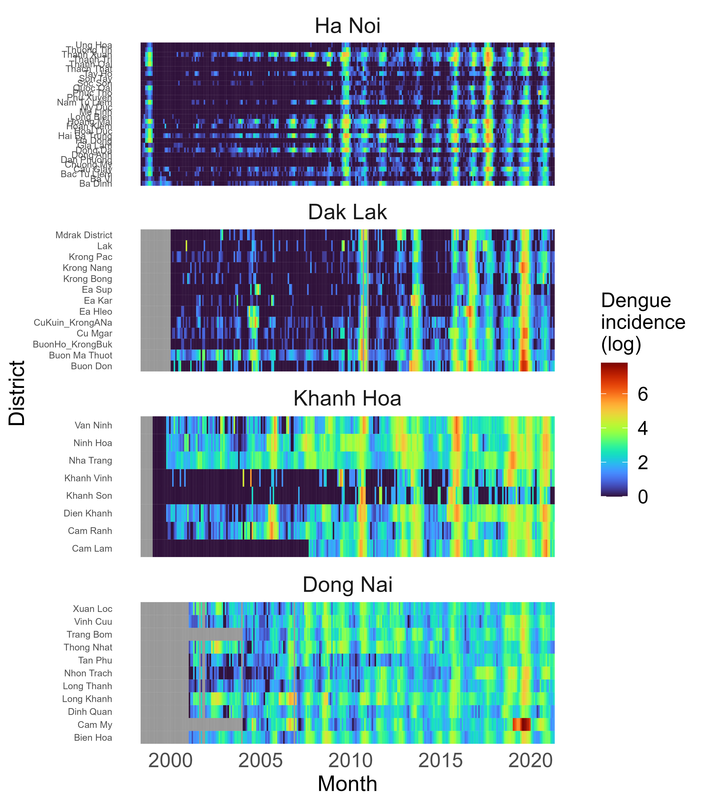

# The interaction of urban infrastructure, mobility and climatic change in driving dengue emergence in Vietnam

Analysis repository for Gibb _et al._ manuscript, disentangling the drivers of spatiotemporal patterns and trends of dengue in Vietnam, 1998-2021. This study is a collaboration between authors at London School of Hygeiene and Tropical Medicine (UK), Barcelona Supercomputing Centre, General Department of Preventative Medicine (Vietnam), National Institute of Hygeine and Epidemiology (Ha Noi), Pasteur Institute Nha Trang, Pasteur Institute Ho Chi Minh City, Tay Nguyen Institute of Hygeiene and Epidemiology (Dak Lak), Centers for Disease Control in Dong Nai, Khanh Hoa and Ha Noi, and HR Wallingford (UK). 

This repository contains the full modelling pipeline scripts to implement the analyses in the accompanying manuscript. To demonstrate the modelling pipeline, we provide a subset of the dengue incidence time series data for 4 geographically diverse provinces of Vietnam: Ha Noi (Red River Delta), Dak Lak (Central Highlands), Khanh Hoa (South Central Coast) and Dong Nai (Southeast). Example scripts to implement sections of the pipeline for this subset are provided in the "scripts_example" folder.

## Key locations within repository

 ↳ scripts_full → _complete codebase for data processing and analysis across all of Vietnam_
 ↳ scripts_example → _a subset of numerically-ordered scripts to implement key sections of the pipeline for example provinces_

 ↳ data → _contains dengue incidence data (4 provinces), climate and shapefiles_
 
 ↳ output → covariates → _csvs of socio-environmental and climatic covariates for all Vietnam districts_
 ↳ output → figures → _figures for MS_
 ↳ output → model_data → _compiled csvs of dengue and covariates for use in modelling scripts_
 ↳ output → model_outputs → _where key outputs from modelling pipeline are stored_

## Dengue data for 4 provinces

_Mean annual dengue incidence across all study years for the example provinces_

_Heatmap of monthly dengue incidence per district for the full time series, for the example provinces_

